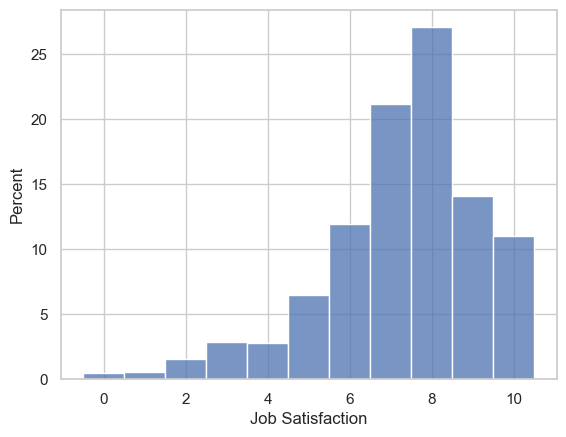
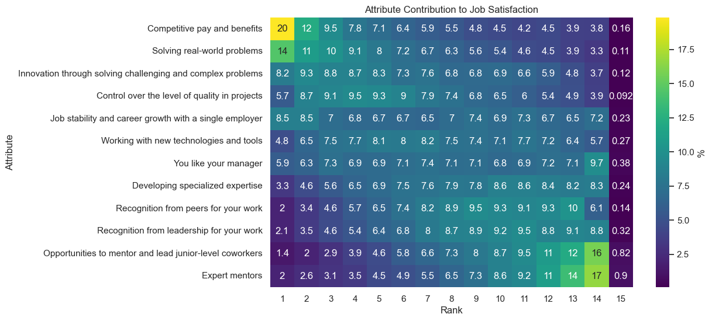
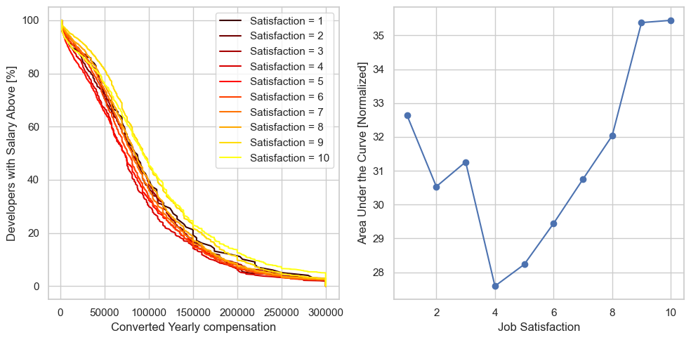

# Cracking the Code to Developer Satisfaction
Insights from the Stack Overflow Annual Survey of 2025

## Introduction

Every year, Stack Overflow surveys thousands of users around the world to understand their experiences, preferences, and challenges. The results can be downloaded here: https://survey.stackoverflow.co/. In this post, I will dive into the 2025 survey results to explore one key question: **What drives job satisfaction among developers?**

For this analysis, I will focus on professional developers with at least three years of experience, who were employed or self-employed at the time of the survey. I will also exclude responses from participants who did not answer the Job Satisfaction question to ensure the integrity of our results.

A histogram of job satisfaction scores (ranging from 0 to 10) reveals that developers tend to report high levels of satisfaction. The most frequently selected score is 8, indicating that many developers are generally content with their work.

**Where does this satisfaction come from?**

## Analysis

### What job attributes contribute to job satisfaction?

One survey question offers valuable insight by asking participants to rank a list of job attributes based on how much they contribute to overall satisfaction, from most to least important. The figure below illustrates the percentage of times each attribute was assigned to each rank, with attributes sorted so that those most frequently ranked highly appear at the top. This gives us a clearer picture of what developers value most in their work.

<em>Note: some of the attributes were not reported in the downloaded data. I also removed the "Other" attribure. This explain why there are 15 rank positions but only 12 attributes.</em>

The first surprise — or perhaps not — is that recognition and leadership consistently appear at the bottom of the rankings, making them the least influential factors in developer job satisfaction. Even liking one’s manager ranks relatively low. 

At the top of the list, three broad categories emerge. The clear winner is compensation, which stands out as the most important factor by a wide margin. Next comes a cluster of attributes related to what is being developed — including interest in the problem being solved, the level of innovation, and the tools used. Finally, job stability rounds out the top tier, highlighting the importance of security in a developer’s professional life.

### Does earning more directly translates to greater job satisfaction?

It’s well known that many people are drawn to software development by the promise of high salaries. But does earning more actually translate to greater job satisfaction? To explore this, let's examine the survey data whether compensation correlates with how satisfied developers feel in their roles.

The plot on the left displays the cumulative distribution of developer salaries, with curves color-coded by job satisfaction levels. A curve that shifts further to the right indicates higher salaries among that group. For instance, 46% of developers who report a job satisfaction score of 10 earn a six-digit salary or more, compared to just 30% of those with a satisfaction score of 4.

There’s a clear trend: **higher compensation tends to correlate with higher job satisfaction**. 

However, this doesn’t tell the whole story. On one hand, there are plenty of developers earning high salaries who report low satisfaction, and vice versa. On the other hand, the plot on the right shows the area under the salary distribution curve as a function of satisfaction. While this area generally increases with satisfaction, an interesting reversal occurs below a satisfaction level of 4: developers in this group tend to have higher compensation than those just above them in satisfaction. 

This could be due to smaller sample sizes (since most developers report being satisfied), but it might also suggest that factors beyond salary play a significant role in developer dissatisfaction.

###  What is the impact of AI on job satisfaction?

One possible explanation for this disconnect is uncertainty about how AI might reshape the developer role. 

The survey reveals widespread adoption of AI tools, even though trust in their outputs varies significantly. While innovation and learning new technologies rank high among the factors contributing to job satisfaction, job stability ranks even higher. This tension could explain why some developers report lower satisfaction despite earning high salaries, since they may feel that rapid technological change threatens long-term security.

The histogram on the left shows that 35% of developers view AI as a threat or remain uncertain about its impact, a notably high figure. The histogram on the right breaks down job satisfaction within each response group. Developers with satisfaction scores of 8 or higher tend to be less concerned about AI replacing their jobs, while the opposite trend appears among those with lower satisfaction. 

This relationship is statistically supported by a Mann-Whitney U test, which confirms that developers who do not perceive AI as a threat report significantly higher job satisfaction.

## Conclusion

The 2025 Stack Overflow survey paints an encouraging picture: developers are generally satisfied with their work. Yet the rise of AI introduces a new layer of uncertainty that could undermine this trend if not managed thoughtfully. Concerns about job security and potential salary reductions are real, especially since compensation remains the strongest driver of satisfaction.

However, the same survey offers a roadmap for addressing these challenges. Developers value learning new tools and solving meaningful problems. If AI is embraced as an enabler rather than a replacement, helping developers innovate and tackle complex real-world issues, fear will diminish and satisfaction will grow. Achieving this requires more than technology; it demands transparency and trust. Companies must clearly communicate how AI is used, what decisions it influences, and how it benefits both the business and its people.

Ultimately, the responsibility lies with organizations to lead AI adoption in a human-centric way. By prioritizing continuous learning, fostering trust, and positioning AI as a tool to amplify human creativity, companies can turn potential disruption into an opportunity for growth, ensuring that developers remain not only productive but genuinely fulfilled in the years ahead.